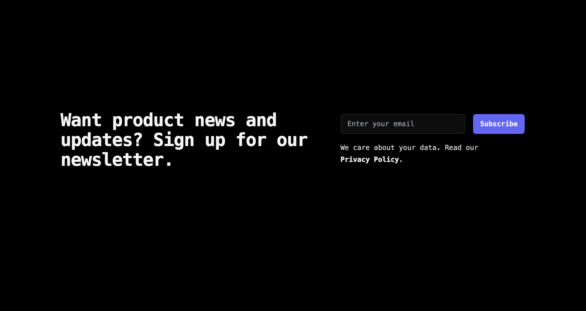

## Blog-subscription-form



This is a blog subscription form build with [Next.js](https://nextjs.org/) [`create-next-app`](https://github.com/vercel/next.js/tree/canary/packages/create-next-app) and [Tailwind](https://tailwindcss.com/).

## Getting Started

First, run the development server:

```bash
npm install
npm run dev
```

Open [http://localhost:3000](http://localhost:3000) with your browser to see the result.

You can start editing the page by modifying `app/page.tsx`. The page auto-updates as you edit the file.

